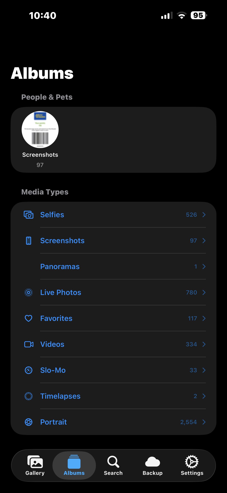
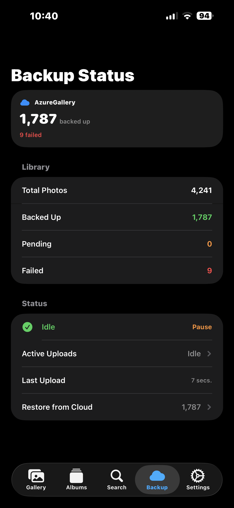
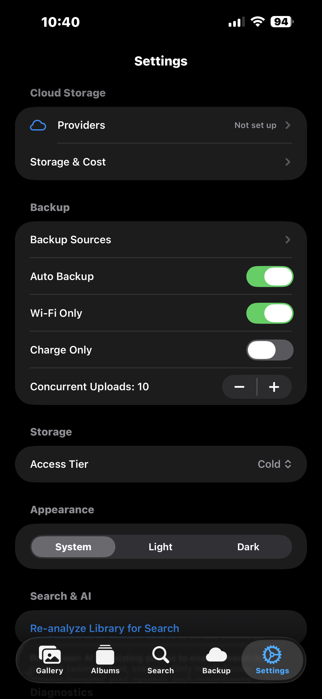
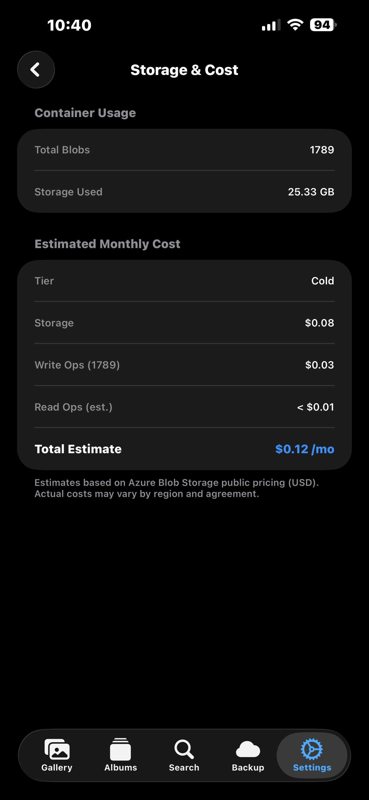
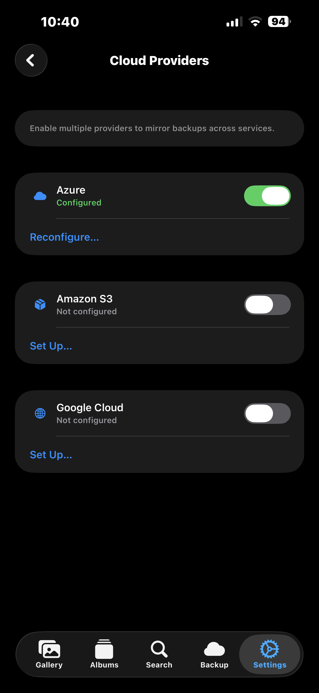

# AzureGallery

**Back up your iPhone photos to your own cloud storage. 10-15x cheaper than iCloud.**

| Storage | iCloud | Google One | AzureGallery |
|---------|--------|-----------|-------------|
| 50 GB | $11.88/yr | $23.88/yr | **$2.16/yr** |
| 100 GB | $11.88/yr | $23.88/yr | **$4.32/yr** |
| 200 GB | $35.88/yr | $23.88/yr | **$8.64/yr** |
| 1 TB | $131.88/yr | $131.88/yr | **$43.20/yr** |

**How AzureGallery pricing works:** You pay only for what you use — **$0.0036 per GB per month** (about 4 cents per GB per year). No fixed tiers, no minimum. Use 73 GB? Pay for exactly 73 GB. iCloud and Google force you into 50/200 GB/2 TB buckets and you pay for the full tier even if you only use half.

Uploads are free. Downloads (restoring to a new phone) cost ~$0.01/GB — a one-time 100 GB restore is about $1. S3 and GCP offer similar pay-as-you-go pricing.

You own the storage. No one else touches your photos.

## The Problem

Every photo backup service is a subscription you're locked into, controlled by someone else. AzureGallery backs up your entire photo library to storage *you* own — Azure, S3, or Google Cloud — at a fraction of the cost, with zero infrastructure to manage.

## Features

- **Local-first gallery** — browse photos and videos from your device. Zero network during daily use. Swipe, pinch-to-zoom, play videos inline.
- **Background backup** — new photos are detected and uploaded automatically, even when the app is killed or the phone restarts.
- **Multi-cloud** — back up to Azure Blob Storage, Amazon S3, and Google Cloud Storage simultaneously. Enable any combination.
- **Smart deduplication** — SHA-256 content hashing skips duplicate uploads. HEAD check skips blobs that already exist (handles reinstalls).
- **On-demand restore** — browse cloud-only files by month with thumbnail previews. Download individually or an entire month at once.
- **AI-powered search** — find photos by content: "cat", "beach sunset", "text in screenshots". Uses on-device Vision + NLEmbedding, no data leaves your phone.
- **Cloud badge overlays** — every photo in the gallery shows its backup status at a glance.
- **Storage dashboard** — see exactly how many blobs, how much storage, and estimated monthly cost per tier.
- **Configurable** — Wi-Fi only, charge only, concurrent upload limit (1-20), storage tier (Hot/Cool/Cold/Archive), album-based backup selection.
- **Diagnostic logs** — in-app logs with share button. Shake to export. Auto-expire after 24 hours.

## Installation

### Prerequisites

- Mac with Xcode 16+ installed
- iPhone running iOS 17.0 or later
- An Apple Developer account (free or paid — free works for personal device testing)
- At least one cloud storage account: [Azure](https://portal.azure.com), [AWS](https://aws.amazon.com), or [Google Cloud](https://console.cloud.google.com)

### Build from source

```bash
git clone https://github.com/anthropics/AzureGallery.git
cd AzureGallery/AzureGallery
open AzureGallery.xcodeproj
```

In Xcode:
1. Select your Team under **Signing & Capabilities** (any Apple ID works)
2. Connect your iPhone and select it as the run destination
3. Press **Cmd+R** to build and run

Or from the command line:
```bash
# Build for simulator
xcodebuild build -scheme AzureGallery -destination 'platform=iOS Simulator,name=iPhone 17'

# Run tests
xcodebuild test -scheme AzureGallery -destination 'platform=iOS Simulator,name=iPhone 17'
```

### Cloud provider setup

**Azure Blob Storage:**
1. Create a Storage Account in [Azure Portal](https://portal.azure.com)
2. Create a container (e.g., `photos`)
3. Go to **Access keys** and copy the Connection String
4. In the app: Settings → Cloud Providers → Azure → paste connection string + container name

**Amazon S3:**
1. Create an S3 bucket in [AWS Console](https://s3.console.aws.amazon.com)
2. Create an IAM user with `AmazonS3FullAccess` (or scoped policy for your bucket)
3. Generate Access Key ID and Secret Access Key
4. In the app: Settings → Cloud Providers → Amazon S3 → enter credentials + bucket + region

**Google Cloud Storage:**
1. Create a bucket in [Cloud Console](https://console.cloud.google.com/storage)
2. Go to **Settings → Interoperability** and create an HMAC key
3. In the app: Settings → Cloud Providers → Google Cloud → enter HMAC key + secret + bucket

## Getting Started

1. Open the app — onboarding walks you through photo access and cloud setup
2. Configure at least one cloud provider in Settings → Cloud Providers
3. Select which albums to back up (or back up everything)
4. Photos upload automatically in the background

## Contributing

Pull requests welcome. Run the test suite before submitting:

```bash
xcodebuild test -scheme AzureGallery -destination 'platform=iOS Simulator,name=iPhone 17'
# 261 tests, 0 failures
```

## Screenshots

<p align="center">



</p>
<p align="center">



</p>

*Gallery with cloud badges | Albums | Backup status | Settings | Storage & cost | Cloud providers*

## License

MIT License

Copyright (c) 2025 Yogesh Kumar

Permission is hereby granted, free of charge, to any person obtaining a copy
of this software and associated documentation files (the "Software"), to deal
in the Software without restriction, including without limitation the rights
to use, copy, modify, merge, publish, distribute, sublicense, and/or sell
copies of the Software, and to permit persons to whom the Software is
furnished to do so, subject to the following conditions:

The above copyright notice and this permission notice shall be included in all
copies or substantial portions of the Software.

THE SOFTWARE IS PROVIDED "AS IS", WITHOUT WARRANTY OF ANY KIND, EXPRESS OR
IMPLIED, INCLUDING BUT NOT LIMITED TO THE WARRANTIES OF MERCHANTABILITY,
FITNESS FOR A PARTICULAR PURPOSE AND NONINFRINGEMENT. IN NO EVENT SHALL THE
AUTHORS OR COPYRIGHT HOLDERS BE LIABLE FOR ANY CLAIM, DAMAGES OR OTHER
LIABILITY, WHETHER IN AN ACTION OF CONTRACT, TORT OR OTHERWISE, ARISING FROM,
OUT OF OR IN CONNECTION WITH THE SOFTWARE OR THE USE OR OTHER DEALINGS IN THE
SOFTWARE.
